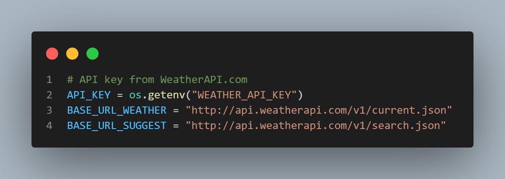
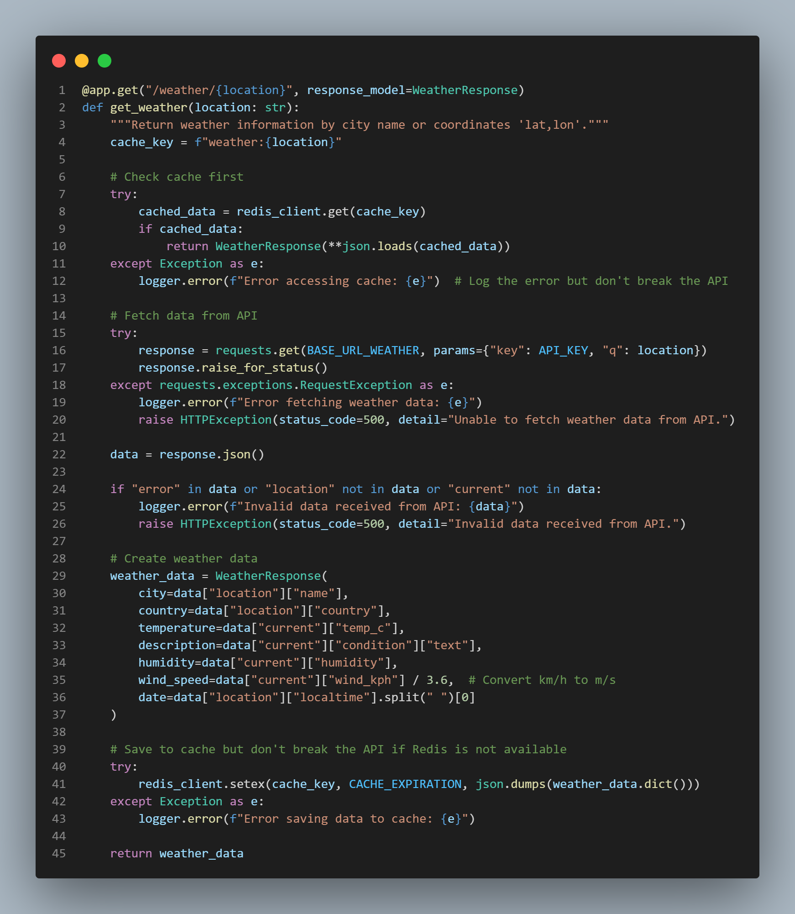
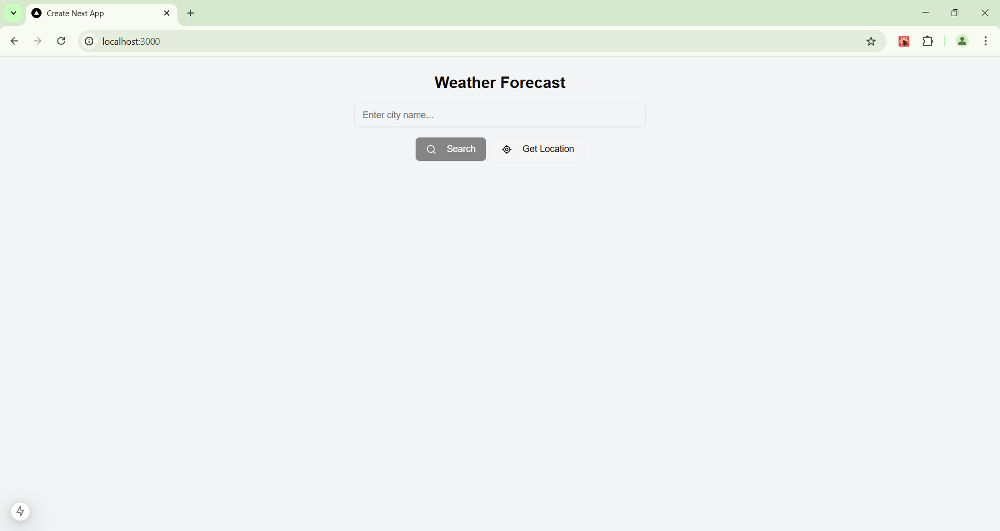
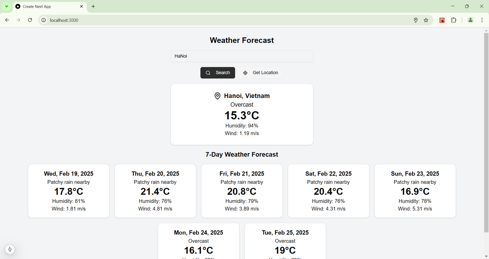
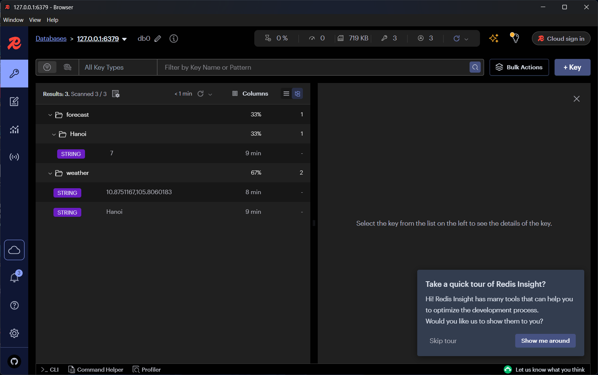
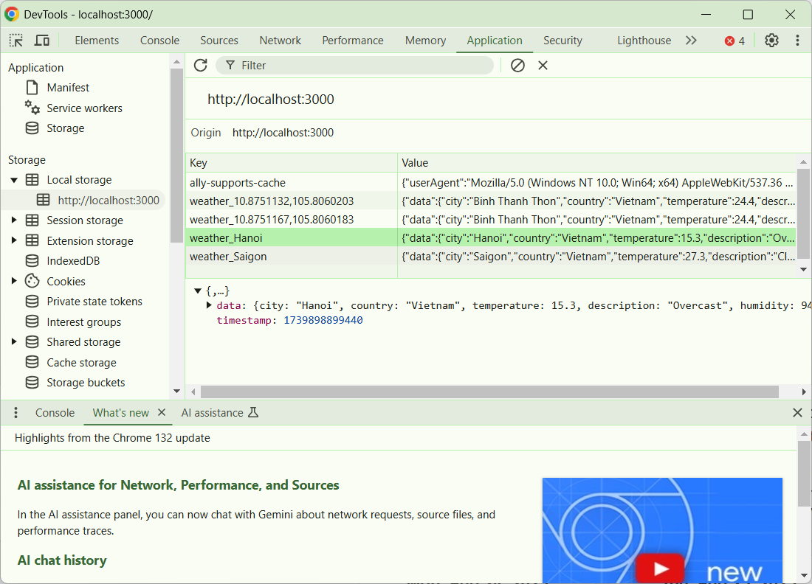
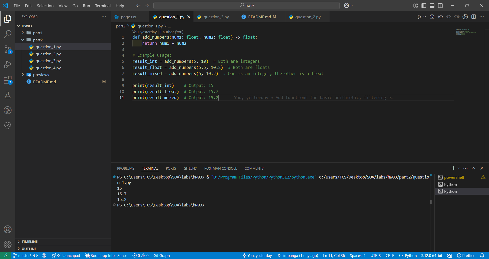
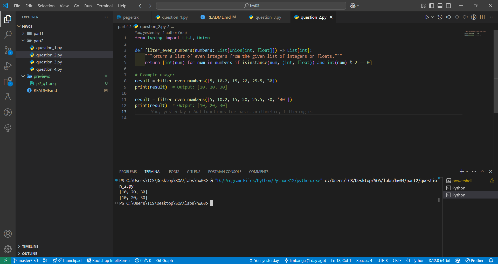
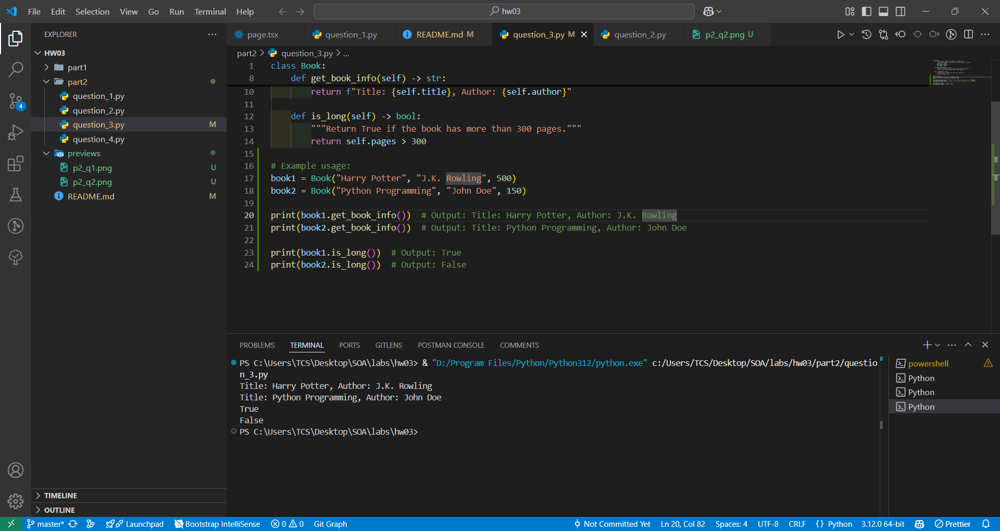
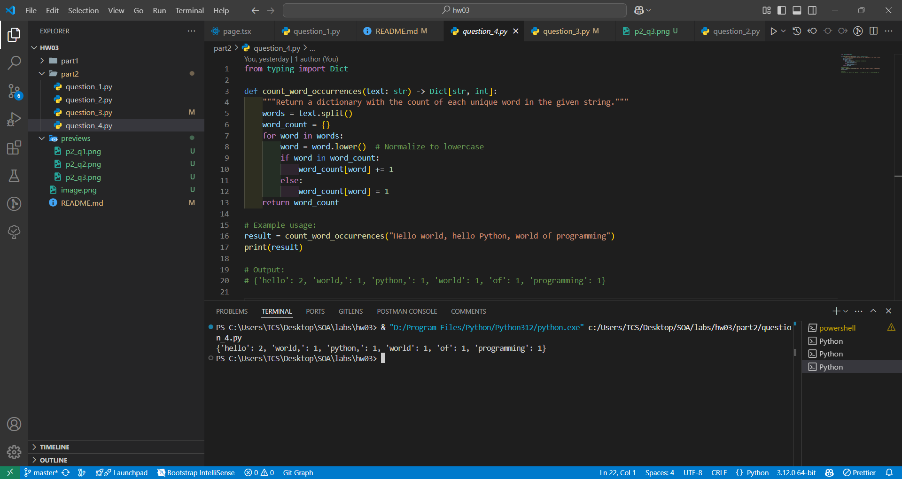

# SOA-Homework-02 - Microservices

- Student Name: Huỳnh Thanh Liêm
- Student ID: 52100813

## Part 1: Weather Data Fetcher
**Objective**:
To develop a Java/Python application that retrieves real-time weather data for a specified location using an external Weather API.

**What I do in this task**:
- API Integration:

> Use free weather API [https://www.weatherapi.com/].
Register and obtain an API key if necessary.

> Make an HTTP request to the Weather API to fetch weather data for the user-specified location.

> Parse the JSON response received from the API. Extract key information such as temperature, humidity, and weather description.

> Implement error handling for scenarios like invalid location input, API request failures, and parsing errors.

> Display the fetched weather information in a user-friendly format.

> Implement a logging system to log errors and important information for debugging purposes. 

- Web GUI Interface:

> Create a graphical user interface (GUI) so that users can input the location and view the weather data.

- Optimize system:

> Implement a caching mechanism to store and retrieve recent weather queries to reduce API calls. 
> - Client: 
>   - Debounce
>   - Local storage
> - Server:
>   - Redis cache

- Add extradition feature
> Add features fetching a 7-day weather forecast.

## Part 2: Python Type Hint
**Question 1:**
> Create a function add_numbers that takes two parameters, num1 and num2, which are both integers, and returns their sum. Use type hints for both the parameters and the return type. Extend the function to handle float and integer inputs and return the appropriate type based on the inputs.

> *Previews*

**Question 2:**
> Write a function filter_even_numbers that takes a list of integers and returns a new list containing only the even numbers from the original list. Use type hints for the input list and the return list. Modify the function to accept a list of integers or floats and return a list of only the integers that are even.

> *Previews*

**Question 3:**
> Define a class Book with properties title (string) and author (string). Add type hints to the __init__ method and create a method get_book_info that returns a formatted string containing the title and author. Add a property pages (integer) to the Book class and a method is_long that returns True if the book has more than 300 pages.

> *Previews*

**Question 4:**
> Write a function count_word_occurrences that takes a string and returns a dictionary where keys are unique words in the string and values are the number of times each word appears. Use type hints for the function parameters and return type. Modify the function to handle case sensitivity and punctuation.

> *Preview*

